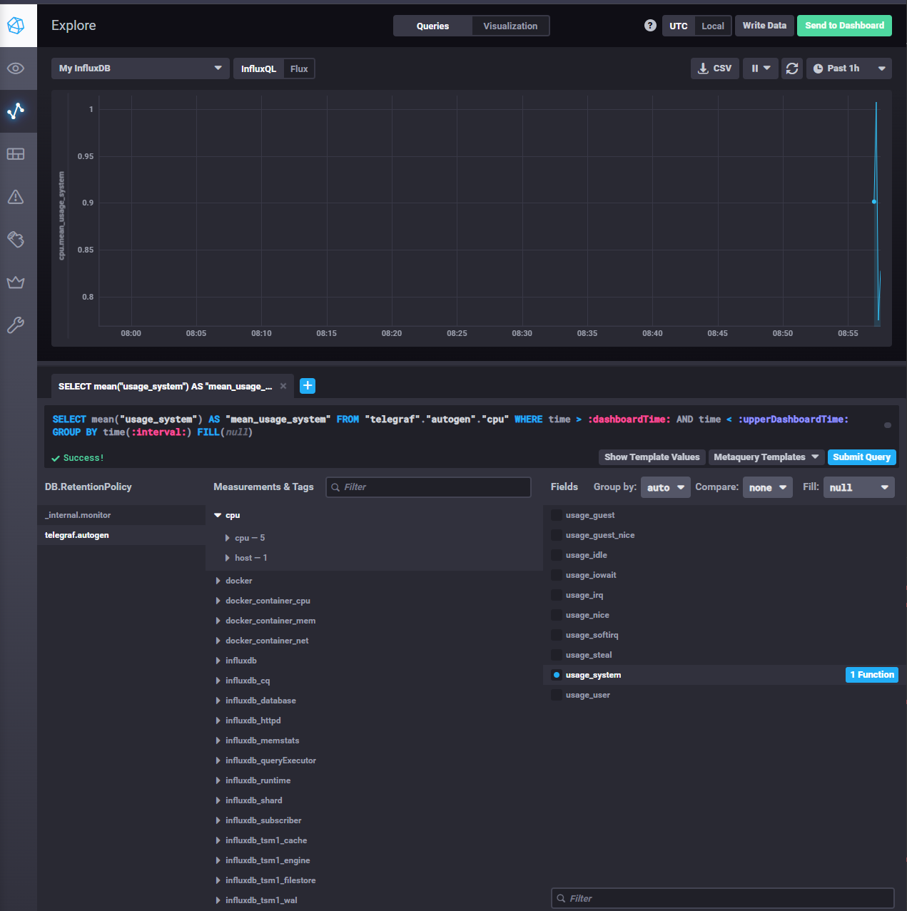
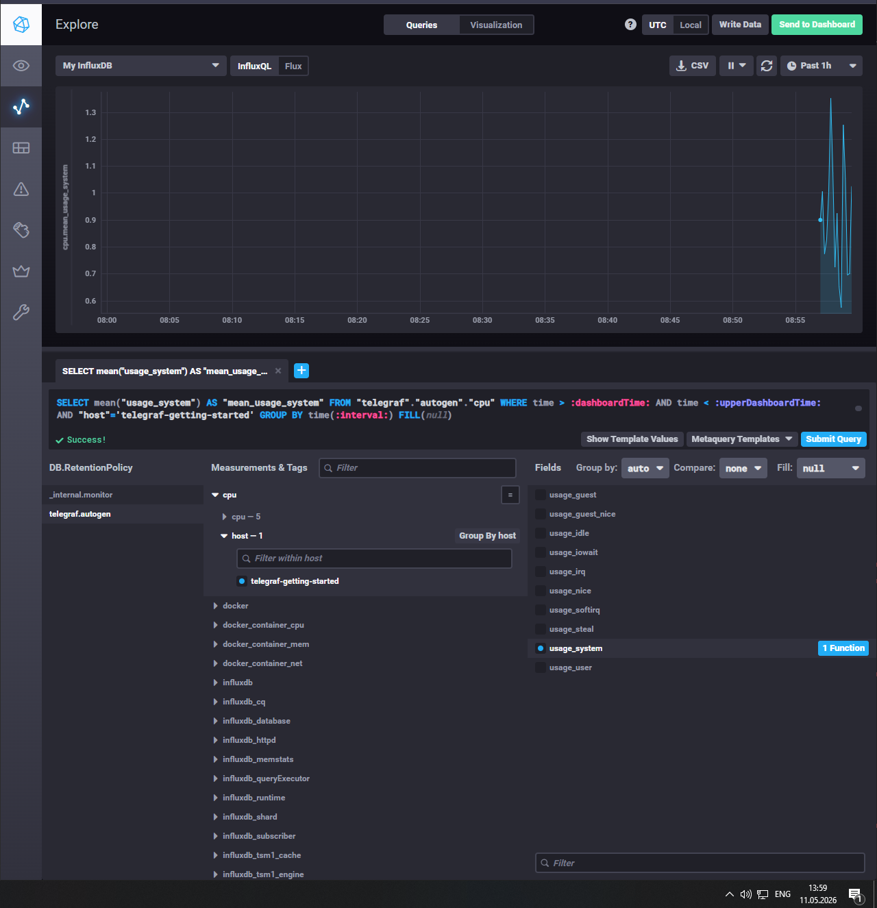
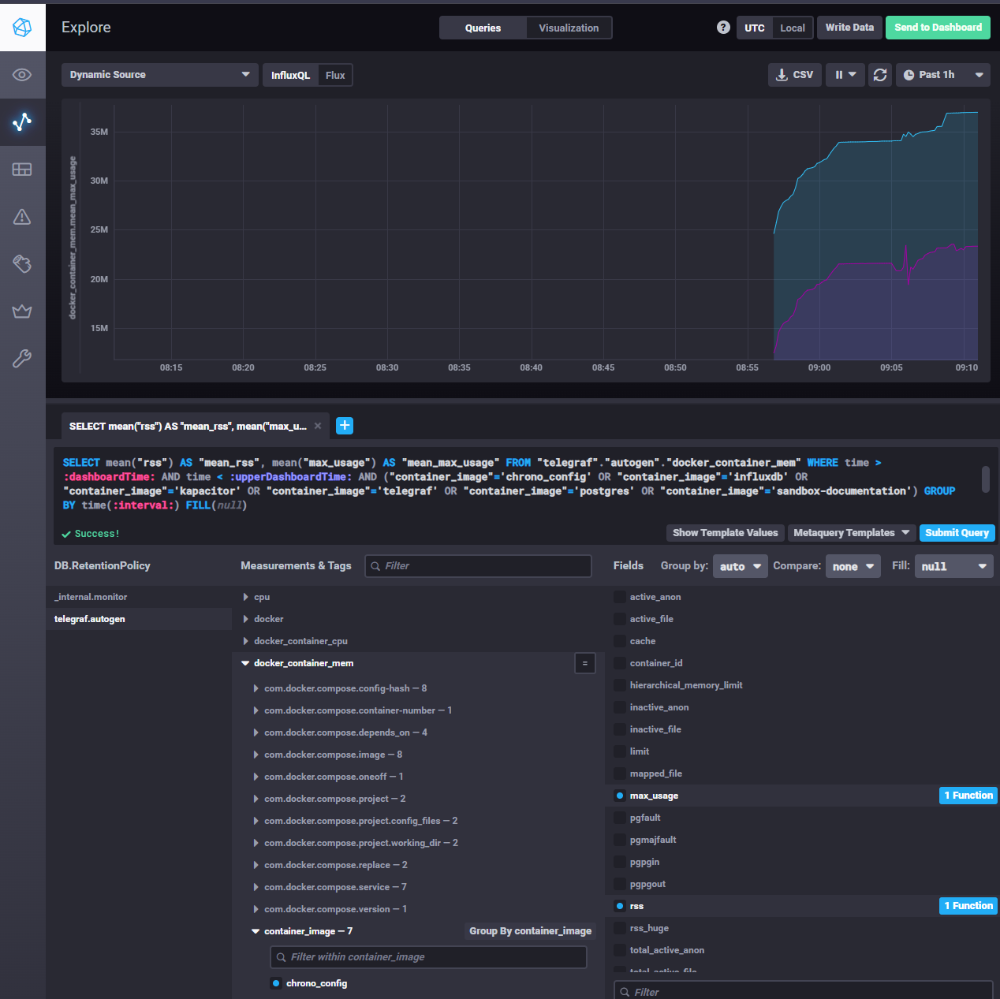

# Обязательные задания
## 1. Минимально я бы вывел HTTP-метрики, CPU, RAM, Load Average, свободное место на диске, inodes, Disk I/O и метрики генерации отчётов.

## 2. Для менеджера продукта я бы сделал отдельный дашборд с бизнес-метриками: доступность сервиса, процент успешных запросов, количество ошибок, время ответа, время формирования отчётов и процент успешно сформированных отчётов. Технические метрики CPU/RAM/disk/inodes оставил бы для DevOps/SRE-команды

## 3. Если денег на полноценную систему логирования нет, можно использовать более простые и дешёвые варианты. Если приложение запущено в Docker, разработчики смогут смотреть ошибки через: docker logs <container_name> Если приложение работает как systemd-сервис, ошибки можно смотреть через: journalctl -u <service_name> -f. Дополнительно можно настроить отправку критических ошибок в Telegram/Slack/Email через простой webhook. Более правильное решение без покупки коммерческой системы - использовать open-source 

## 4. Ошибка в том, что успешными запросами считаются только HTTP 2xx. При отсутствии 4xx и 5xx оставшиеся 30% могут быть 3xx или другими кодами. Нужно проверить распределение всех HTTP-кодов и определить, какие коды считаются успешными для SLA.

## 5. Плюсы push: удобно для серверов за NAT/firewall; подходит для короткоживущих задач; агент сам отправляет данные наружу; проще в сетях, где нельзя открыть входящие подключения. Минусы push: сложнее понять, что источник умер; больше риска получить мусорные или устаревшие метрики; сложнее централизованно контролировать частоту отправки; при большом количестве агентов может быть высокая нагрузка на приёмник.

## 6. Zabbix, VictoriaMetrics - гибрид, Prometheus - pull, TICK - push, Nagios — pull/гибрид

# 01

# 02

# 03

